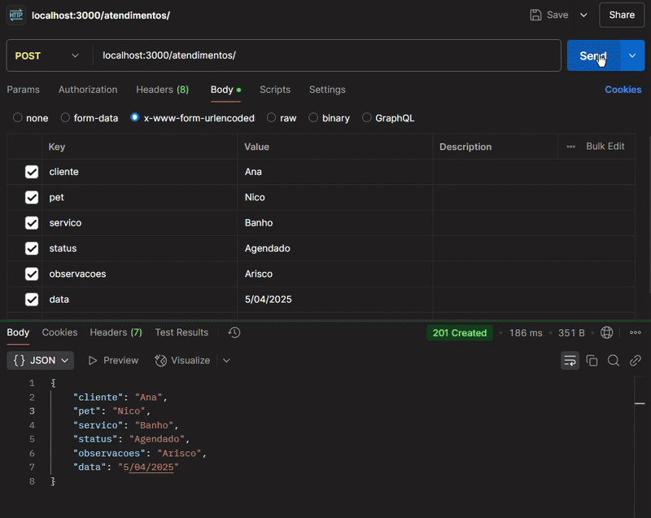

 # API de Pet-shop com EXPRESS

## API CRUD de serviços (Pet-shop exemplo)

Essa API, cria no banco de dados o atendimento do serviço, com a seguinte estrutura: 

| id | cliente | pet | servico | observacoes | data | data_criacao |
|----|---------|-----|---------|-------------|------|--------------|
| 1  | Felipe  | Kiki | Tosa | agendado | 2025-04-01 | 2025-04-01 17:44 |

## Como usar ?
Esta api ela comunica diretamente com uma requisição post, onde são enviados os dados da seguinte maneira (Exemplo usando Postman):

Após essa requisição POST, os dados são cadastrados em um banco de dados em MySql:

O sistema também aceita DELETE e PATCH (UPDATE)

